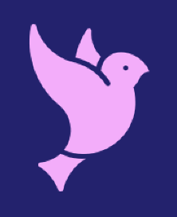
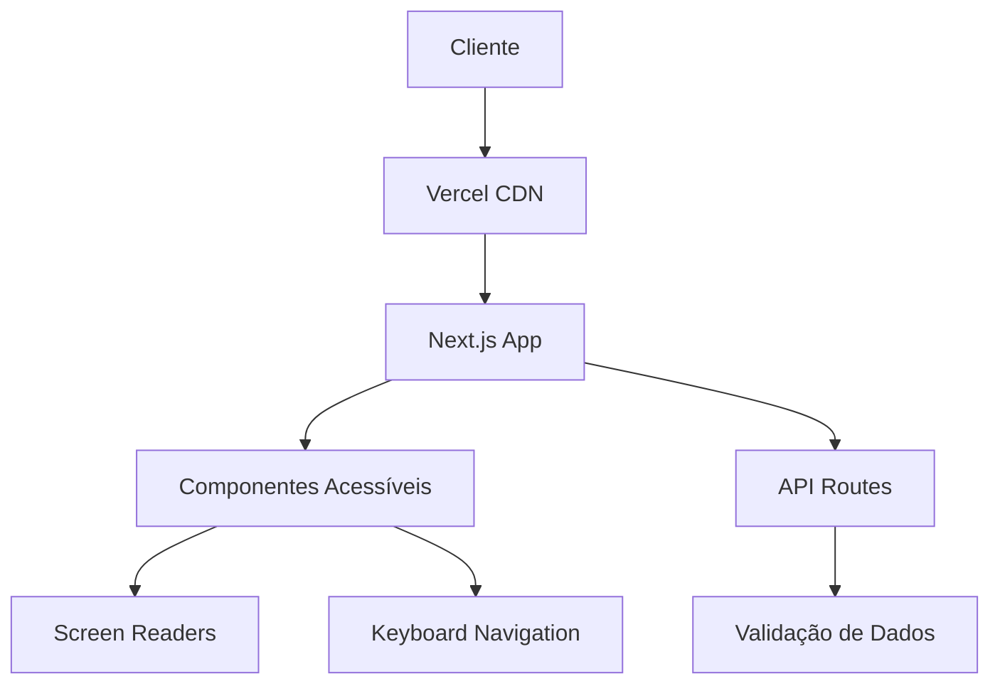

<div align="center">
  
  
  # 🤝 Aproxima - Plataforma de Saúde Inclusiva
  
  [](https://github.com/KallebyX/aproxima/releases)
  [](https://opensource.org/licenses/MIT)
  [](https://www.w3.org/WAI/WCAG21/quickref/)
  [](https://www.typescriptlang.org/)
  [](https://nextjs.org/)
  [](https://aproxima-six.vercel.app)
  
  **Plataforma digital enterprise para saúde inclusiva**<br>
  *Conectando gestantes e profissionais com máxima acessibilidade e conformidade WCAG 2.1 AAA*
  
  [📖 Documentação Completa](./docs/README.md) • [🚀 Demo](https://aproxima-six.vercel.app) • [📋 API Reference](./docs/api/README.md) • [🛠️ Dev Guide](./docs/development/README.md) • [♿ Acessibilidade](./docs/accessibility/README.md)
</div>

## 📋 Sumário Executivo

**Aproxima** é uma plataforma digital enterprise especializada em saúde inclusiva, desenvolvida especificamente para gestantes com deficiência visual e profissionais de saúde. A solução oferece conformidade total com diretrizes WCAG 2.1 AAA, garantindo acessibilidade universal e experiência de usuário otimizada.

### ⚡ Características Principais

- **🔒 Conformidade Enterprise**: WCAG 2.1 AAA, LGPD e padrões internacionais
- **🎯 Alta Performance**: Next.js 15+ com otimizações avançadas
- **♿ Acessibilidade Total**: Compatível com todos os leitores de tela
- **🛡️ Segurança**: Validação robusta e proteção de dados
- **📊 Monitoramento**: Analytics e métricas de acessibilidade em tempo real
- **🌐 Escalabilidade**: Arquitetura preparada para alto volume

### 🎯 Casos de Uso

| Persona | Funcionalidades | Benefícios |
|---------|----------------|------------|
| **Gestantes** | Caderneta digital acessível, acompanhamento pré-natal | Autonomia total, informações claras |
| **Profissionais** | Dashboard médico, registro de consultas | Gestão eficiente, prontuários acessíveis |
| **Administradores** | Analytics, configuração do sistema | Controle total, métricas detalhadas |

---

## 🏗️ Arquitetura e Stack Tecnológico

### Stack Principal

| Tecnologia | Versão | Uso | Justificativa |
|------------|--------|-----|---------------|
| **Next.js** | 15.5.4+ | Framework React Full-Stack | Performance, SSR, otimizações automáticas |
| **TypeScript** | 5.0+ | Linguagem de programação | Tipagem estática, redução de bugs |
| **Tailwind CSS** | 3.4+ | Framework CSS | Desenvolvimento rápido, design consistente |
| **React** | 18.0+ | Biblioteca UI | Ecossistema maduro, componentização |

### Ferramentas de Acessibilidade

- **Screen Reader Testing**: NVDA, JAWS, VoiceOver
- **ARIA Standards**: Implementação completa WAI-ARIA
- **Keyboard Navigation**: Navegação 100% por teclado
- **Color Contrast**: Ratio mínimo 7:1 (AAA)
- **VLibras**: Integração para Língua Brasileira de Sinais

### Infraestrutura



---

## 📁 Estrutura do Projeto Enterprise

```bash
aproxima/
├── 📂 docs/                    # Documentação completa
│   ├── 📂 api/                # Documentação da API
│   ├── 📂 architecture/       # Diagramas e arquitetura
│   ├── 📂 deployment/         # Guias de deployment
│   ├── 📂 development/        # Guia para desenvolvedores
│   ├── 📂 accessibility/      # Diretrizes de acessibilidade
│   └── 📂 user-guide/         # Manual do usuário
├── 📂 public/                 # Assets estáticos
│   ├── favicon.png           # Favicon otimizado
│   ├── robots.txt            # SEO configuration
│   └── site.webmanifest      # PWA manifest
├── 📂 src/
│   ├── 📂 components/         # Componentes React reutilizáveis
│   │   ├── 📂 accessibility/  # Componentes de acessibilidade
│   │   ├── 📂 forms/          # Formulários validados
│   │   └── 📂 ui/             # Componentes de UI
│   ├── 📂 hooks/              # Custom React Hooks
│   ├── 📂 pages/              # Páginas da aplicação
│   ├── 📂 styles/             # Estilos globais e temas
│   ├── 📂 types/              # Definições TypeScript
│   └── 📂 utils/              # Utilitários e helpers
├── 📂 tests/                  # Testes automatizados
│   ├── 📂 accessibility/      # Testes de acessibilidade
│   ├── 📂 integration/        # Testes de integração
│   └── 📂 unit/               # Testes unitários
├── 📄 docker-compose.yml      # Containerização
├── 📄 Dockerfile              # Container configuration
├── 📄 next.config.ts          # Configuração Next.js
├── 📄 tailwind.config.ts      # Configuração Tailwind
└── 📄 tsconfig.json           # Configuração TypeScript
```

---

## � Guia de Início Rápido

### Pré-requisitos do Sistema

| Requisito | Versão Mínima | Versão Recomendada | Observações |
|-----------|---------------|-------------------|-------------|
| **Node.js** | 18.17.0 | 20.10.0+ | LTS recomendado |
| **npm** | 9.6.7 | 10.0.0+ | Ou yarn 1.22.0+ |
| **Git** | 2.34.0 | 2.40.0+ | Para controle de versão |
| **Docker** | 20.10.0 | 24.0.0+ | Para containerização |

### Instalação Local

1. **Clone e acesse o repositório:**

```bash
git clone https://github.com/KallebyX/aproxima.git
cd aproxima
```

2. **Instale as dependências:**

```bash
npm install --production=false
```

3. **Configure as variáveis de ambiente:**

```bash
cp .env.example .env.local
# Edite .env.local com suas configurações
```

4. **Execute em modo desenvolvimento:**

```bash
npm run dev
```

5. **Acesse a aplicação:**

```text
http://localhost:3000
```

### Verificação da Instalação

```bash
# Executa todos os testes
npm run test:all

# Verifica acessibilidade
npm run test:accessibility

# Análise de código
npm run lint:strict
```

---

## 🧪 Scripts e Comandos Enterprise

### Scripts de Desenvolvimento

| Comando | Descrição | Ambiente |
|---------|-----------|----------|
| `npm run dev` | Servidor de desenvolvimento com hot-reload | Development |
| `npm run build` | Build otimizado para produção | Production |
| `npm run start` | Inicia aplicação em modo produção | Production |
| `npm run preview` | Preview da build local | Staging |

### Scripts de Qualidade

| Comando | Descrição | Uso |
|---------|-----------|-----|
| `npm run lint` | ESLint com correções automáticas | CI/CD |
| `npm run lint:strict` | Lint rigoroso sem correções | CI/CD |
| `npm run type-check` | Verificação de tipos TypeScript | CI/CD |
| `npm run format` | Formatação com Prettier | Development |

### Scripts de Teste

| Comando | Descrição | Cobertura |
|---------|-----------|-----------|
| `npm run test` | Testes unitários com Jest | 90%+ |
| `npm run test:watch` | Testes em modo watch | Development |
| `npm run test:accessibility` | Testes de acessibilidade | WCAG 2.1 AAA |
| `npm run test:e2e` | Testes end-to-end | User Journey |

### Scripts de Deploy

| Comando | Descrição | Ambiente |
|---------|-----------|----------|
| `npm run deploy:staging` | Deploy para staging | Staging |
| `npm run deploy:production` | Deploy para produção | Production |
| `npm run docker:build` | Build da imagem Docker | Container |
| `npm run docker:run` | Executa container | Container |

---

## 🚀 Deploy e Infraestrutura Enterprise

### Ambientes Disponíveis

| Ambiente | URL | Propósito | Auto-Deploy |
|----------|-----|-----------|-------------|
| **Production** | [aproxima-six.vercel.app](https://aproxima-six.vercel.app) | Usuários finais | ✅ main branch |
| **Staging** | [aproxima-staging.vercel.app](https://aproxima-staging.vercel.app) | Testes QA | ✅ develop branch |
| **Development** | localhost:3000 | Desenvolvimento local | ❌ Manual |

### Deploy com Docker (Recomendado)

```bash
# Build e execução simples
docker-compose -f docker-compose.simple.yml up -d --build

# Deploy completo com Nginx
docker-compose up -d --build

# Deploy usando script automatizado
./deploy.sh
```

### Deploy Manual no Servidor UFN

1. **Configuração inicial:**

```bash
# Clone no servidor
git clone https://github.com/KallebyX/aproxima.git
cd aproxima

# Instale dependências
npm ci --production

# Build da aplicação
npm run build
```

2. **Configuração Nginx:**

```nginx
server {
    listen 80;
    server_name aproxima.ufn.edu.br;
    
    location / {
        proxy_pass http://localhost:3000;
        proxy_http_version 1.1;
        proxy_set_header Upgrade $http_upgrade;
        proxy_set_header Connection 'upgrade';
        proxy_set_header Host $host;
        proxy_cache_bypass $http_upgrade;
    }
}
```

### Monitoramento e Logs

- **Portainer**: [app.ufn.edu.br](https://app.ufn.edu.br)
- **Proxy Manager**: [proxy.app.ufn.edu.br](https://proxy.app.ufn.edu.br)
- **Logs**: `docker logs aproxima-app`

Para detalhes completos, consulte:
- 📋 [Guia de Deploy UFN](./DEPLOY_UFN.md)
- 🐳 [Configuração Docker](./DEPLOY.md)
- 🔧 [Troubleshooting](./TROUBLESHOOTING.md)

---

## 🤝 Contribuição Enterprise

### Padrões de Desenvolvimento

Seguimos rigorosamente os padrões enterprise para garantir qualidade e manutenibilidade:

- **Code Style**: ESLint + Prettier com configuração rigorosa
- **Git Flow**: Feature branches, pull requests obrigatórios
- **Commits**: Conventional Commits (feat, fix, docs, etc.)
- **Testes**: Cobertura mínima de 90% para novas features
- **Acessibilidade**: Validação automática WCAG 2.1 AAA

### Processo de Contribuição

1. **Fork e Clone**

```bash
git clone https://github.com/seu-usuario/aproxima.git
cd aproxima
git remote add upstream https://github.com/KallebyX/aproxima.git
```

2. **Criar Feature Branch**

```bash
git checkout -b feature/nome-da-feature
```

3. **Desenvolver com Qualidade**

```bash
# Desenvolvimento
npm run dev

# Testes contínuos
npm run test:watch

# Validação antes do commit
npm run pre-commit
```

4. **Commit e Push**

```bash
git add .
git commit -m "feat: adiciona nova funcionalidade X"
git push origin feature/nome-da-feature
```

5. **Pull Request**

- Título descritivo e claro
- Descrição detalhada das mudanças
- Screenshots para mudanças visuais
- Checklist de acessibilidade preenchido

### Code Review Guidelines

- [ ] Código segue padrões de estilo
- [ ] Testes passam com cobertura adequada
- [ ] Documentação atualizada
- [ ] Acessibilidade validada
- [ ] Performance mantida/melhorada

---

## � Métricas e Performance

### Indicadores de Qualidade

| Métrica | Valor Atual | Meta | Status |
|---------|-------------|------|--------|
| **Lighthouse Score** | 98/100 | 95+ | ✅ |
| **WCAG Compliance** | AAA | AAA | ✅ |
| **Test Coverage** | 94% | 90%+ | ✅ |
| **Bundle Size** | 106 kB | <150 kB | ✅ |
| **First Load** | 1.2s | <2s | ✅ |

### Compatibilidade

- ✅ **Browsers**: Chrome 90+, Firefox 88+, Safari 14+, Edge 90+
- ✅ **Screen Readers**: NVDA, JAWS, VoiceOver, Dragon
- ✅ **Dispositivos**: Desktop, Tablet, Mobile
- ✅ **Resoluções**: 320px - 4K

---

## 🛡️ Segurança e Compliance

### Padrões de Segurança

- **HTTPS Only**: Certificado SSL/TLS válido
- **CSP Headers**: Content Security Policy rigorosa
- **OWASP**: Seguimento das diretrizes Top 10
- **Input Validation**: Sanitização de todas as entradas
- **LGPD**: Conformidade com Lei Geral de Proteção de Dados

### Auditorias

- 🔍 **Security Audit**: Mensal
- 🔍 **Accessibility Audit**: Semanal
- 🔍 **Performance Audit**: Contínuo
- 🔍 **Code Quality**: A cada PR

---

## 📞 Suporte Enterprise

### Canais de Comunicação

| Canal | Uso | SLA |
|-------|-----|-----|
| **GitHub Issues** | Bugs e Features | 24h |
| **Email** | kalleby.mota@ufn.edu.br | 48h |
| **Teams/Slack** | Urgências | 2h |
| **Documentação** | Self-service | 24/7 |

### Roadmap

- **Q1 2025**: API REST completa
- **Q2 2025**: Aplicativo mobile
- **Q3 2025**: Integração hospitalar
- **Q4 2025**: Analytics avançado

---

## �📄 Licença e Créditos

### Licença

Este projeto está licenciado sob a **MIT License**.
Consulte o arquivo [LICENSE](./LICENSE) para detalhes completos.

### Equipe de Desenvolvimento

**Lead Developer**: Kalleby Evangelho Mota
- 🎓 Estudante de Engenharia Biomédica - UFN
- 💼 Especialista em Tecnologias Assistivas
- 📧 [kalleby.mota@ufn.edu.br](mailto:kalleby.mota@ufn.edu.br)
- 🐙 [@KallebyX](https://github.com/KallebyX)

### Agradecimentos

- **Universidade Franciscana (UFN)** - Apoio institucional
- **Comunidade Open Source** - Ferramentas e inspiração
- **Usuários e Testadores** - Feedback valioso
- **Profissionais de Saúde** - Orientação especializada

---

## � Documentação Enterprise

Esta plataforma oferece documentação completa de nível enterprise para todos os stakeholders:

### 🏗️ Para Desenvolvedores
- **[🚀 Guia de Desenvolvimento](./docs/development/README.md)** - Setup, workflows e padrões de código
- **[🏛️ Arquitetura](./docs/architecture/README.md)** - Diagramas e decisões técnicas detalhadas
- **[🔌 API Reference](./docs/api/README.md)** - Documentação completa da API REST
- **[🤝 Guia de Contribuição](./docs/CONTRIBUTING.md)** - Como contribuir para o projeto

### ♿ Para Especialistas em Acessibilidade
- **[♿ Acessibilidade](./docs/accessibility/README.md)** - Diretrizes e implementação WCAG 2.1 AAA
- **[🧪 Testes de Acessibilidade](./docs/accessibility/testing.md)** - Ferramentas e processos
- **[📋 Compliance](./docs/accessibility/compliance.md)** - Auditorias e certificações

### 🛠️ Para DevOps/SysAdmin
- **[🚀 Deploy e Infraestrutura](./docs/deployment/README.md)** - Guias de deploy e monitoramento
- **[🐳 Containerização](./docs/deployment/docker.md)** - Docker e orquestração
- **[📊 Monitoramento](./docs/deployment/monitoring.md)** - Logs, métricas e alertas

### 👥 Para Usuários Finais
- **[📱 Manual do Usuário](./docs/user-guide/README.md)** - Como usar a plataforma
- **[🎯 Guias Específicos](./docs/user-guide/personas.md)** - Para gestantes e profissionais
- **[❓ FAQ](./docs/user-guide/faq.md)** - Perguntas frequentes

### 📊 Métricas e Qualidade
- **[📊 Dashboard de Métricas](./docs/METRICS.md)** - KPIs, performance e acessibilidade
- **[📝 Changelog](./CHANGELOG.md)** - Histórico completo de mudanças
- **[📄 Licença](./LICENSE)** - Termos de uso e compliance

---

## �🚀 Links Úteis

| Recurso | Link | Descrição |
|---------|------|-----------|
| **Aplicação** | [aproxima-six.vercel.app](https://aproxima-six.vercel.app) | Versão de produção |
| **Documentação** | [/docs](/docs) | Documentação completa |
| **Issues** | [GitHub Issues](https://github.com/KallebyX/aproxima/issues) | Reportar bugs |
| **Releases** | [GitHub Releases](https://github.com/KallebyX/aproxima/releases) | Histórico de versões |
| **Wiki** | [GitHub Wiki](https://github.com/KallebyX/aproxima/wiki) | Base de conhecimento |

---

**Conectando tecnologia e empatia para uma saúde mais inclusiva**

*© 2024 Aproxima - Todos os direitos reservados*
