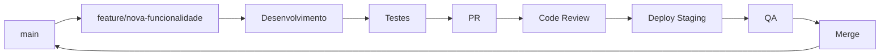
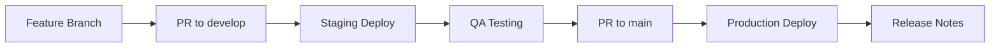

# 🤝 Guia de Contribuição - Aproxima

## 🎯 Bem-vindo à Equipe Aproxima

Este guia orienta desenvolvedores, designers e profissionais de saúde sobre como contribuir para a plataforma Aproxima, mantendo nossos altos padrões de qualidade e acessibilidade.

## 📋 Índice

1. [Filosofia de Contribuição](#-filosofia-de-contribuição)
2. [Configuração do Ambiente](#️-configuração-do-ambiente)
3. [Fluxo de Desenvolvimento](#-fluxo-de-desenvolvimento)
4. [Padrões de Código](#-padrões-de-código)
5. [Testes e Qualidade](#-testes-e-qualidade)
6. [Documentação](#-documentação)
7. [Revisão de Código](#-revisão-de-código)
8. [Deploy e Release](#-deploy-e-release)

## 🌟 Filosofia de Contribuição

### Nossos Valores

1. **Acessibilidade Primeiro**: Toda contribuição deve manter ou melhorar a acessibilidade
2. **Qualidade sobre Velocidade**: Preferimos código bem testado e documentado
3. **Colaboração Inclusiva**: Valorizamos diversidade de perspectivas
4. **Transparência**: Processo aberto e comunicação clara
5. **Impacto Social**: Foco no benefício para gestantes e profissionais de saúde

### Código de Conduta

- ✅ **Respeitoso**: Tratamos todos com dignidade e profissionalismo
- ✅ **Inclusivo**: Bem-vindas pessoas de todas as origens e habilidades
- ✅ **Construtivo**: Feedback focado em melhorias, não críticas pessoais
- ✅ **Colaborativo**: Compartilhamos conhecimento e ajudamos uns aos outros
- ❌ **Zero tolerância**: Para discriminação, assédio ou comportamento tóxico

## 🛠️ Configuração do Ambiente

### Pré-requisitos

```bash
# Versões mínimas requeridas
node --version    # ≥ 18.17.0
npm --version     # ≥ 9.6.7
git --version     # ≥ 2.40.0
```

### Setup Inicial

```bash
# 1. Fork e clone do repositório
git clone https://github.com/SEU_USERNAME/aproxima.git
cd aproxima

# 2. Configurar remotes
git remote add upstream https://github.com/KallebyX/aproxima.git
git remote -v

# 3. Instalar dependências
npm install

# 4. Configurar ambiente
cp .env.example .env.local
# Editar .env.local com suas configurações

# 5. Executar testes
npm run test

# 6. Iniciar desenvolvimento
npm run dev
```

### Ferramentas Recomendadas

#### VS Code Extensions

```json
{
  "recommendations": [
    "ms-vscode.vscode-typescript-next",
    "bradlc.vscode-tailwindcss",
    "esbenp.prettier-vscode",
    "ms-vscode.vscode-eslint",
    "deque-systems.vscode-axe-linter",
    "streetsidesoftware.code-spell-checker",
    "ms-playwright.playwright"
  ]
}
```

#### Git Hooks (Husky)

```bash
# Automaticamente instalado com npm install
# Executa antes de cada commit:
# - ESLint
# - Prettier
# - Testes de acessibilidade
# - Validação de commit message
```

## 🔄 Fluxo de Desenvolvimento

### Git Workflow



### Convenção de Branches

```bash
# Novas funcionalidades
feature/acessibilidade-melhorada
feature/caderneta-digital

# Correções de bugs
fix/contraste-cores-botoes
fix/navegacao-teclado

# Melhorias de performance
perf/otimizacao-imagens
perf/lazy-loading

# Documentação
docs/guia-acessibilidade
docs/api-reference

# Configuração e infraestrutura
chore/docker-setup
chore/ci-pipeline
```

### Convenção de Commits

Utilizamos [Conventional Commits](https://www.conventionalcommits.org/) com foco em acessibilidade:

```bash
# Formato
<tipo>[escopo opcional]: <descrição>

# Exemplos
feat(accessibility): adicionar suporte a leitor de tela
fix(forms): corrigir validação de campos obrigatórios
docs(api): atualizar documentação de endpoints
style(ui): melhorar contraste de cores para WCAG AAA
test(a11y): adicionar testes de navegação por teclado
perf(images): otimizar carregamento de imagens
refactor(hooks): simplificar hook de acessibilidade
```

### Tipos de Commit

| Tipo | Descrição | Exemplo |
|------|-----------|---------|
| `feat` | Nova funcionalidade | feat(gestante): adicionar acompanhamento pré-natal |
| `fix` | Correção de bug | fix(a11y): corrigir foco em modais |
| `docs` | Apenas documentação | docs(readme): atualizar instruções de setup |
| `style` | Formatação, CSS | style(button): melhorar contraste AAA |
| `refactor` | Refatoração de código | refactor(utils): otimizar função de validação |
| `test` | Adicionar/corrigir testes | test(forms): adicionar testes de acessibilidade |
| `chore` | Manutenção | chore(deps): atualizar dependências |
| `perf` | Melhoria de performance | perf(images): implementar lazy loading |
| `ci` | Integração contínua | ci(github): adicionar workflow de testes |

## 📝 Padrões de Código

### TypeScript Guidelines

```typescript
// ✅ BOM: Tipos explícitos e documentados
interface AccessibilitySettings {
  /** Ativar alto contraste para usuários com baixa visão */
  highContrast: boolean;
  
  /** Aumentar tamanho do texto para melhor legibilidade */
  largeText: boolean;
  
  /** Reduzir animações para usuários sensíveis a movimento */
  reducedMotion: boolean;
}

// ✅ BOM: Função com JSDoc completo
/**
 * Atualiza configurações de acessibilidade do usuário
 * 
 * @param userId - ID único do usuário
 * @param settings - Novas configurações de acessibilidade
 * @returns Promise com as configurações atualizadas
 * 
 * @example
 * ```typescript
 * const novasConfiguracoes = await updateAccessibilitySettings('123', {
 *   highContrast: true,
 *   largeText: false,
 *   reducedMotion: true
 * });
 * ```
 */
export async function updateAccessibilitySettings(
  userId: string,
  settings: Partial<AccessibilitySettings>
): Promise<AccessibilitySettings> {
  // Implementação...
}

// ❌ RUIM: Sem tipos, sem documentação
function updateSettings(id, settings) {
  // Implementação...
}
```

### React Components

```tsx
// ✅ BOM: Componente acessível e bem documentado
interface ButtonProps {
  /** Conteúdo do botão */
  children: React.ReactNode;
  
  /** Variante visual do botão */
  variant?: 'primary' | 'secondary' | 'ghost';
  
  /** Se o botão está desabilitado */
  disabled?: boolean;
  
  /** Texto alternativo para screen readers */
  ariaLabel?: string;
  
  /** ID do elemento que descreve o botão */
  ariaDescribedBy?: string;
  
  /** Função executada no clique */
  onClick?: () => void;
}

/**
 * Botão acessível que segue padrões WCAG 2.1 AAA
 * 
 * @example
 * ```tsx
 * <Button 
 *   variant="primary"
 *   ariaLabel="Salvar configurações de acessibilidade"
 *   onClick={handleSave}
 * >
 *   Salvar
 * </Button>
 * ```
 */
export const Button: React.FC<ButtonProps> = ({
  children,
  variant = 'primary',
  disabled = false,
  ariaLabel,
  ariaDescribedBy,
  onClick,
  ...props
}) => {
  return (
    <button
      type="button"
      disabled={disabled}
      onClick={onClick}
      aria-label={ariaLabel}
      aria-describedby={ariaDescribedBy}
      className={getButtonClasses(variant, disabled)}
      {...props}
    >
      {children}
    </button>
  );
};

// ❌ RUIM: Sem acessibilidade, sem tipos
function Button({ children, onClick }) {
  return <button onClick={onClick}>{children}</button>;
}
```

### CSS/Tailwind Guidelines

```tsx
// ✅ BOM: Classes organizadas por responsabilidade
const buttonClasses = [
  // Layout e dimensões
  'inline-flex items-center justify-center',
  'min-h-[44px] px-4 py-2', // Área de toque adequada (44px)
  
  // Tipografia
  'text-base font-medium',
  'text-center leading-tight',
  
  // Aparência
  'bg-primary-600 text-white',
  'border border-transparent rounded-lg',
  
  // Estados interativos
  'hover:bg-primary-700 active:bg-primary-800',
  'focus:outline-none focus:ring-4 focus:ring-primary-500/50',
  
  // Acessibilidade
  'disabled:opacity-50 disabled:cursor-not-allowed',
  'transition-colors duration-200 ease-in-out',
  
  // Motion preferences
  'motion-reduce:transition-none'
].join(' ');

// ❌ RUIM: Classes desordenadas, sem consideração de acessibilidade
const badClasses = 'bg-blue-500 text-white p-2 hover:bg-blue-600 rounded';
```

### Acessibilidade Checklist

#### Para Componentes

- [ ] **Contraste de cores**: Mínimo 7:1 (WCAG AAA)
- [ ] **Área de toque**: Mínimo 44x44px
- [ ] **Navegação por teclado**: Tab, Enter, Space, Escape
- [ ] **Screen readers**: ARIA labels, roles, descriptions
- [ ] **Estados visuais**: Focus, hover, disabled claramente visíveis
- [ ] **Animações**: Respeitam `prefers-reduced-motion`

```tsx
// Exemplo de checklist aplicado
const AccessibleInput: React.FC<InputProps> = ({ 
  label, 
  error, 
  required = false,
  ...props 
}) => {
  const id = useId();
  const errorId = `${id}-error`;
  
  return (
    <div className="space-y-2">
      {/* Label associado corretamente */}
      <label 
        htmlFor={id}
        className="block text-sm font-medium text-gray-700"
      >
        {label}
        {required && (
          <span className="text-red-500 ml-1" aria-label="campo obrigatório">
            *
          </span>
        )}
      </label>
      
      {/* Input com ARIA adequado */}
      <input
        id={id}
        aria-required={required}
        aria-invalid={!!error}
        aria-describedby={error ? errorId : undefined}
        className={`
          block w-full px-3 py-2 min-h-[44px]
          border border-gray-300 rounded-md
          focus:ring-2 focus:ring-primary-500 focus:border-primary-500
          disabled:bg-gray-50 disabled:text-gray-500
          ${error ? 'border-red-500 focus:ring-red-500' : ''}
        `}
        {...props}
      />
      
      {/* Erro acessível */}
      {error && (
        <p 
          id={errorId}
          className="text-sm text-red-600"
          role="alert"
        >
          {error}
        </p>
      )}
    </div>
  );
};
```

## 🧪 Testes e Qualidade

### Estratégia de Testes

#### 1. Testes Unitários (Jest)

```typescript
// tests/utils/accessibility.test.ts
import { checkColorContrast, isKeyboardNavigable } from '@/utils/accessibility';

describe('Accessibility Utils', () => {
  describe('checkColorContrast', () => {
    it('should return true for WCAG AAA compliant colors', () => {
      const result = checkColorContrast('#000000', '#FFFFFF');
      expect(result.ratio).toBeGreaterThan(7);
      expect(result.isAAA).toBe(true);
    });
    
    it('should return false for insufficient contrast', () => {
      const result = checkColorContrast('#888888', '#999999');
      expect(result.ratio).toBeLessThan(7);
      expect(result.isAAA).toBe(false);
    });
  });
});
```

#### 2. Testes de Componentes (Testing Library)

```typescript
// tests/components/Button.test.tsx
import { render, screen } from '@testing-library/react';
import userEvent from '@testing-library/user-event';
import { Button } from '@/components/ui/Button';

describe('Button Component', () => {
  it('should be accessible via keyboard', async () => {
    const handleClick = jest.fn();
    render(<Button onClick={handleClick}>Clique aqui</Button>);
    
    const button = screen.getByRole('button', { name: /clique aqui/i });
    
    // Testar foco
    await userEvent.tab();
    expect(button).toHaveFocus();
    
    // Testar ativação por teclado
    await userEvent.keyboard('{Enter}');
    expect(handleClick).toHaveBeenCalledTimes(1);
    
    await userEvent.keyboard(' ');
    expect(handleClick).toHaveBeenCalledTimes(2);
  });
  
  it('should announce state changes to screen readers', async () => {
    const { rerender } = render(<Button disabled>Carregando</Button>);
    
    const button = screen.getByRole('button');
    expect(button).toHaveAttribute('aria-disabled', 'true');
    
    rerender(<Button>Concluído</Button>);
    expect(button).not.toHaveAttribute('aria-disabled');
  });
});
```

#### 3. Testes de Acessibilidade (axe-core)

```typescript
// tests/accessibility/pages.test.tsx
import { render } from '@testing-library/react';
import { axe, toHaveNoViolations } from 'jest-axe';
import HomePage from '@/pages/index';

expect.extend(toHaveNoViolations);

describe('Page Accessibility', () => {
  it('should have no accessibility violations', async () => {
    const { container } = render(<HomePage />);
    
    const results = await axe(container, {
      rules: {
        // Ativar regras WCAG AAA
        'color-contrast-enhanced': { enabled: true }
      }
    });
    
    expect(results).toHaveNoViolations();
  });
});
```

#### 4. Testes E2E (Playwright)

```typescript
// tests/e2e/accessibility.spec.ts
import { test, expect } from '@playwright/test';
import AxeBuilder from '@axe-core/playwright';

test.describe('Accessibility E2E', () => {
  test('should be fully keyboard navigable', async ({ page }) => {
    await page.goto('/');
    
    // Testar navegação por teclado
    await page.keyboard.press('Tab');
    const firstFocusable = await page.locator(':focus');
    await expect(firstFocusable).toBeVisible();
    
    // Verificar que todos os elementos interativos são alcançáveis
    let tabCount = 0;
    const maxTabs = 50; // Limite de segurança
    
    while (tabCount < maxTabs) {
      await page.keyboard.press('Tab');
      tabCount++;
      
      const focused = await page.locator(':focus');
      if (await focused.count() === 0) break;
    }
    
    expect(tabCount).toBeGreaterThan(5); // Pelo menos 5 elementos focáveis
  });
  
  test('should pass axe accessibility tests', async ({ page }) => {
    await page.goto('/');
    
    const accessibilityScanResults = await new AxeBuilder({ page })
      .withTags(['wcag2a', 'wcag2aa', 'wcag21aa'])
      .analyze();
    
    expect(accessibilityScanResults.violations).toEqual([]);
  });
});
```

### Comandos de Teste

```bash
# Executar todos os testes
npm run test

# Testes unitários com coverage
npm run test:unit

# Testes de componentes
npm run test:components

# Testes de acessibilidade específicos
npm run test:a11y

# Testes E2E
npm run test:e2e

# Testes em modo watch (desenvolvimento)
npm run test:watch

# Gerar relatório de cobertura
npm run test:coverage
```

## 📚 Documentação

### JSDoc Padrões

```typescript
/**
 * Calcula o contraste entre duas cores seguindo WCAG 2.1
 * 
 * @param foreground - Cor do primeiro plano em formato hex (#RRGGBB)
 * @param background - Cor de fundo em formato hex (#RRGGBB)
 * @returns Objeto com ratio de contraste e conformidade WCAG
 * 
 * @example
 * ```typescript
 * const resultado = calcularContraste('#000000', '#FFFFFF');
 * console.log(resultado.ratio); // 21
 * console.log(resultado.isAAA); // true
 * ```
 * 
 * @see {@link https://www.w3.org/WAI/WCAG21/Understanding/contrast-enhanced.html}
 * @since v2.1.0
 */
export function calcularContraste(
  foreground: string, 
  background: string
): ContrastResult {
  // ...
}
```

### README de Componentes

Cada componente deve ter sua própria documentação:

```typescript
// components/ui/Button/README.md
# Button Component

Botão acessível que segue padrões WCAG 2.1 AAA.

## Uso Básico

```tsx
import { Button } from '@/components/ui/Button';

function App() {
  return (
    <Button variant="primary" onClick={handleClick}>
      Salvar
    </Button>
  );
}
```

## Props

| Prop | Tipo | Padrão | Descrição |
|------|------|--------|-----------|
| `children` | `ReactNode` | - | Conteúdo do botão |
| `variant` | `'primary' \| 'secondary' \| 'ghost'` | `'primary'` | Estilo visual |
| `disabled` | `boolean` | `false` | Se o botão está desabilitado |
| `ariaLabel` | `string` | - | Label para screen readers |

## Acessibilidade

- ✅ Contraste AAA (7:1)
- ✅ Área de toque 44px
- ✅ Navegação por teclado
- ✅ Screen reader friendly
- ✅ Estados visuais claros

## Testes

```bash
npm run test -- Button
```
```

### Changelog

Manter histórico de mudanças organizado:

```markdown
# Changelog

## [2.1.0] - 2024-10-15

### Added
- Suporte completo a WCAG 2.1 AAA
- Componente de toggle de acessibilidade
- Testes automatizados de contraste

### Changed
- Melhorou contraste de cores em todos os componentes
- Otimizou navegação por teclado

### Fixed
- Corrigiu foco em modais
- Resolveu problemas com screen readers

### Accessibility
- Implementou ARIA live regions
- Adicionou skip links
- Melhorou semântica HTML
```

## 👀 Revisão de Código

### Checklist para Reviewers

#### Funcionalidade
- [ ] O código resolve o problema proposto?
- [ ] Não introduz regressões?
- [ ] Performance adequada?
- [ ] Segurança preservada?

#### Acessibilidade
- [ ] Mantém ou melhora acessibilidade?
- [ ] Contraste de cores adequado (7:1)?
- [ ] Navegação por teclado funcional?
- [ ] ARIA labels apropriados?
- [ ] Testes de acessibilidade passando?

#### Qualidade do Código
- [ ] Código limpo e legível?
- [ ] Documentação adequada?
- [ ] Testes suficientes?
- [ ] Sem code smells?
- [ ] Convenções seguidas?

### Template de PR

```markdown
## 📝 Descrição

Breve descrição das mudanças realizadas.

## 🎯 Tipo de Mudança

- [ ] 🐛 Correção de bug
- [ ] ✨ Nova funcionalidade
- [ ] ♿ Melhoria de acessibilidade
- [ ] 🚀 Melhoria de performance
- [ ] 📚 Atualização de documentação
- [ ] 🧹 Refatoração

## ✅ Checklist de Acessibilidade

- [ ] Contraste de cores verificado (7:1 mínimo)
- [ ] Navegação por teclado testada
- [ ] Screen readers testados
- [ ] ARIA labels apropriados
- [ ] Testes de acessibilidade passando

## 🧪 Testes

- [ ] Testes unitários adicionados/atualizados
- [ ] Testes de componentes adicionados/atualizados
- [ ] Testes de acessibilidade adicionados/atualizados
- [ ] Testes E2E verificados (se aplicável)

## 📱 Screenshots/GIFs

### Antes
[Screenshot/GIF do estado anterior]

### Depois
[Screenshot/GIF do estado novo]

## 📋 Notas para Review

Pontos específicos que precisam de atenção especial.

## 🔗 Links Relacionados

- Issue: #123
- Documentação: link
- Spec: link
```

### Processo de Review

1. **Auto-review**: Revisar próprio código antes de abrir PR
2. **Automated checks**: CI/CD deve passar
3. **Peer review**: Pelo menos 1 aprovação necessária
4. **Accessibility review**: Para mudanças que afetam UX
5. **QA validation**: Em staging environment

## 🚀 Deploy e Release

### Environments

| Environment | Branch | URL | Proposito |
|-------------|--------|-----|-----------|
| **Development** | `feature/*` | http://localhost:3000 | Desenvolvimento local |
| **Staging** | `develop` | https://staging.aproxima.com | QA e testes |
| **Production** | `main` | https://aproxima.ufn.edu.br | Produção |

### Release Process



### Versionamento Semântico

```
MAJOR.MINOR.PATCH

2.1.3
│ │ │
│ │ └── Patch: Bug fixes, pequenas correções
│ └──── Minor: Novas funcionalidades, mudanças compatíveis
└────── Major: Breaking changes, mudanças incompatíveis
```

### Deploy Checklist

#### Pré-Deploy
- [ ] Todos os testes passando
- [ ] Review aprovado
- [ ] Documentação atualizada
- [ ] Changelog atualizado
- [ ] QA validado em staging

#### Deploy
- [ ] Deploy executado com sucesso
- [ ] Health checks passando
- [ ] Accessibility tests passando
- [ ] Performance metrics normais

#### Pós-Deploy
- [ ] Monitoramento ativo
- [ ] Logs verificados
- [ ] Métricas de acessibilidade coletadas
- [ ] Rollback preparado (se necessário)

### Hotfix Process

Para correções urgentes em produção:

```bash
# 1. Criar branch de hotfix
git checkout main
git pull origin main
git checkout -b hotfix/critical-accessibility-fix

# 2. Fazer correção mínima
# ... desenvolver fix ...

# 3. Testar localmente
npm run test
npm run test:a11y

# 4. Abrir PR emergencial
# - Revisor obrigatório
# - Deploy imediato após aprovação

# 5. Backport para develop
git checkout develop
git cherry-pick <commit-hash>
```

## 📞 Suporte e Comunidade

### Canais de Comunicação

- **Issues**: Para bugs e sugestões
- **Discussions**: Para dúvidas e discussões técnicas
- **Slack**: Chat interno da equipe
- **Email**: [dev@aproxima.com](mailto:dev@aproxima.com)

### Documentação Adicional

- [Guia de Acessibilidade](./accessibility/README.md)
- [Documentação da API](./api/README.md)
- [Guia de Deployment](./deployment/README.md)
- [Arquitetura](./architecture/README.md)

### FAQ para Contribuidores

**P: Como reportar um bug de acessibilidade?**
R: Use o template de issue "Accessibility Bug" com detalhes sobre screen reader, navegador e tecnologia assistiva.

**P: Preciso testar em múltiplos screen readers?**
R: Sim, testamos principalmente em NVDA (Windows), VoiceOver (macOS) e Orca (Linux).

**P: Como contribuir sem conhecimento técnico?**
R: Pode ajudar com testes de usabilidade, documentação, tradução e feedback sobre acessibilidade.

---

## 🙏 Agradecimentos

Obrigado por contribuir para tornar a gestação mais acessível e inclusiva para todas as mulheres brasileiras.

**Juntos, estamos construindo um futuro mais acessível! 🌟**

---

*Este guia evolui com nossa comunidade. Sugestões são sempre bem-vindas!*

**Última atualização**: Outubro 2024