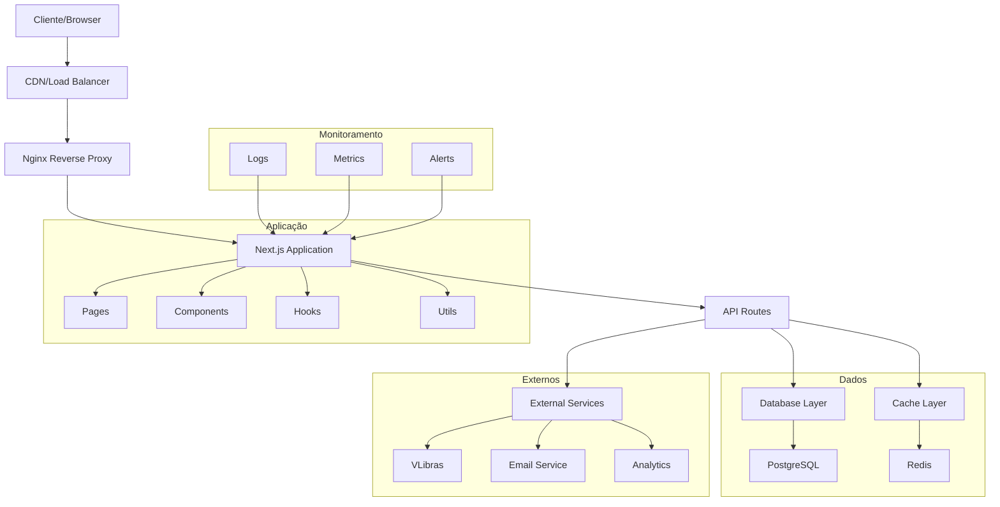
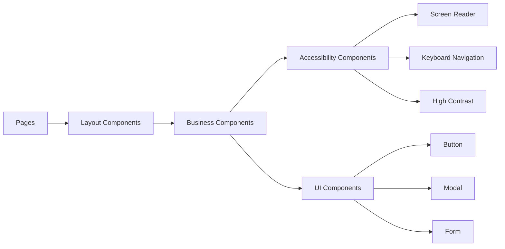
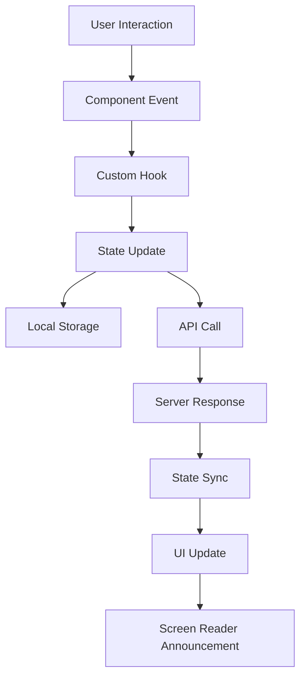
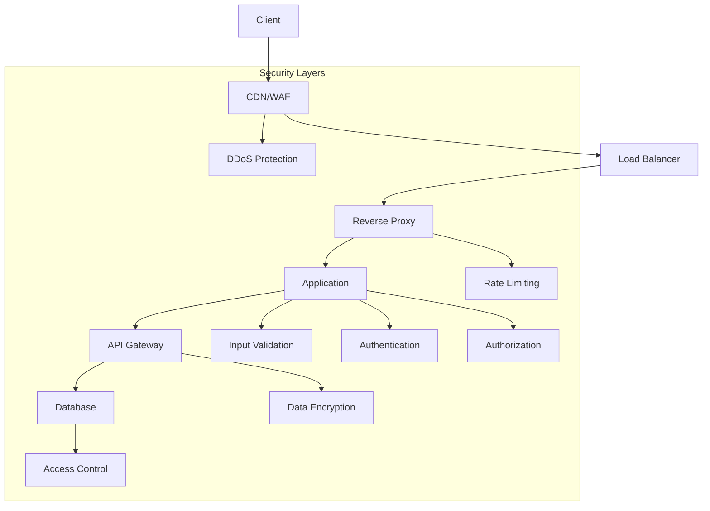
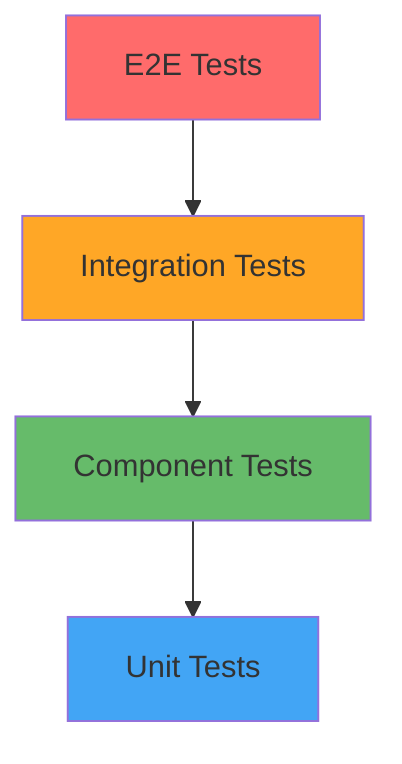
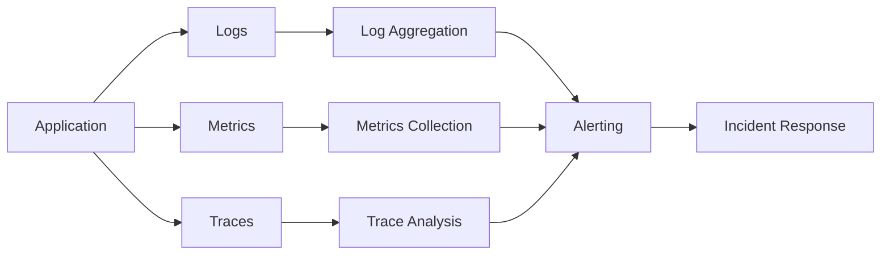

# 🏛️ Documentação de Arquitetura - Aproxima

## 📋 Visão Geral da Arquitetura

A Aproxima foi projetada com uma arquitetura moderna, escalável e totalmente focada em acessibilidade. A plataforma utiliza padrões enterprise para garantir performance, segurança e manutenibilidade.

## 🎯 Princípios Arquiteturais

### 1. Accessibility First
- **WCAG 2.1 AAA**: Conformidade total como requisito não-funcional
- **Progressive Enhancement**: Funcionalidade básica sempre disponível
- **Semantic HTML**: Estrutura semântica em todas as camadas

### 2. Performance by Design
- **SSR/SSG**: Server-Side Rendering e Static Site Generation
- **Code Splitting**: Carregamento otimizado de recursos
- **Caching Strategies**: Múltiplas camadas de cache

### 3. Security & Privacy
- **LGPD Compliance**: Proteção de dados pessoais
- **Zero Trust**: Validação em todas as camadas
- **Encrypted Communication**: HTTPS everywhere

### 4. Scalability & Reliability
- **Microservices Ready**: Preparado para decomposição
- **Horizontal Scaling**: Suporte a load balancing
- **Fault Tolerance**: Graceful degradation

## 🏗️ Arquitetura de Alto Nível



## 📊 Arquitetura de Componentes

### Frontend Architecture



### Estrutura de Diretórios

```
src/
├── 📂 components/              # Componentes React
│   ├── 📂 accessibility/       # Componentes de acessibilidade
│   │   ├── AccessibilityToggle.tsx      # Botão de acessibilidade
│   │   ├── AdvancedAccessibility.tsx    # Painel completo
│   │   ├── ScreenReaderOnly.tsx         # Conteúdo apenas para SR
│   │   ├── SkipLinks.tsx               # Links de navegação rápida
│   │   ├── FocusTrap.tsx               # Gerenciamento de foco
│   │   └── LiveRegion.tsx              # Anúncios dinâmicos
│   ├── 📂 forms/              # Componentes de formulário
│   │   ├── AccessibleForm.tsx           # Formulário acessível
│   │   ├── FormValidator.tsx            # Validação de dados
│   │   └── FieldError.tsx              # Exibição de erros
│   ├── 📂 layout/             # Componentes de layout
│   │   ├── Header.tsx                  # Cabeçalho principal
│   │   ├── Footer.tsx                  # Rodapé
│   │   ├── Navigation.tsx              # Navegação principal
│   │   └── MobileMenu.tsx              # Menu mobile
│   └── 📂 ui/                 # Componentes básicos de UI
│       ├── Button.tsx                  # Botão acessível
│       ├── Modal.tsx                   # Modal acessível
│       ├── Tooltip.tsx                 # Tooltip acessível
│       └── Loading.tsx                 # Indicador de carregamento
├── 📂 hooks/                  # Custom React Hooks
│   ├── useAccessibility.tsx            # Gerenciamento de acessibilidade
│   ├── useWCAGCompliance.tsx           # Verificação WCAG
│   ├── useHTMLRobustness.tsx           # Validação HTML
│   ├── useKeyboardNavigation.tsx       # Navegação por teclado
│   └── useFocusManagement.tsx          # Gerenciamento de foco
├── 📂 pages/                  # Páginas Next.js
│   ├── _app.tsx                        # App principal
│   ├── _document.tsx                   # Document customizado
│   ├── index.tsx                       # Página inicial
│   ├── gestante.tsx                    # Área da gestante
│   ├── area-do-profissional.tsx        # Área do profissional
│   └── api/                           # API Routes
│       ├── health.ts                   # Health check
│       ├── accessibility/              # APIs de acessibilidade
│       └── users/                      # APIs de usuários
├── 📂 styles/                 # Estilos e temas
│   ├── globals.css                     # Estilos globais
│   ├── accessibility.css              # Estilos de acessibilidade
│   └── components.css                  # Estilos de componentes
├── 📂 types/                  # Definições TypeScript
│   ├── global.d.ts                     # Tipos globais
│   ├── accessibility.ts               # Tipos de acessibilidade
│   └── api.ts                         # Tipos da API
└── 📂 utils/                  # Utilitários e helpers
    ├── accessibility.ts               # Funções de acessibilidade
    ├── seo.ts                         # Utilitários SEO
    ├── validation.ts                  # Validação de dados
    └── constants.ts                   # Constantes da aplicação
```

## 🔧 Tecnologias e Stack

### Core Technologies

| Tecnologia | Versão | Propósito | Justificativa |
|------------|--------|-----------|---------------|
| **Next.js** | 15.5.4+ | Framework React Full-Stack | SSR/SSG, otimizações automáticas, API routes |
| **React** | 18.2+ | Biblioteca UI | Componentização, hooks, concurrent features |
| **TypeScript** | 5.0+ | Linguagem | Type safety, melhor DX, documentação viva |
| **Tailwind CSS** | 3.4+ | Framework CSS | Utility-first, design system, responsividade |

### Acessibilidade

| Tecnologia | Versão | Propósito |
|------------|--------|-----------|
| **@axe-core/react** | 4.8+ | Testes automatizados de acessibilidade |
| **@testing-library/jest-dom** | 6.1+ | Matchers para testes de acessibilidade |
| **eslint-plugin-jsx-a11y** | 6.7+ | Linting de acessibilidade |
| **VLibras** | Latest | Tradução para Libras |

### Desenvolvimento e Qualidade

| Tecnologia | Versão | Propósito |
|------------|--------|-----------|
| **ESLint** | 8.57+ | Linting de código |
| **Prettier** | 3.1+ | Formatação de código |
| **Jest** | 29.7+ | Testes unitários |
| **Playwright** | 1.40+ | Testes E2E |
| **Husky** | 8.0+ | Git hooks |

## 🎨 Design System e Acessibilidade

### Tokens de Design

```typescript
// design-tokens.ts
export const designTokens = {
  // Cores com contraste AAA
  colors: {
    primary: {
      50: '#f0f9ff',
      500: '#3b82f6',
      600: '#2563eb',
      700: '#1d4ed8',
      900: '#1e3a8a'
    },
    contrast: {
      minimum: '7:1',      // WCAG AAA
      enhanced: '21:1'     // Máximo contraste
    }
  },
  
  // Tipografia acessível
  typography: {
    fontSize: {
      base: '16px',        // Nunca menor que 16px
      large: '20px',       // Para texto grande
      xl: '24px'           // Para títulos
    },
    lineHeight: {
      tight: '1.25',
      normal: '1.5',       // Mínimo WCAG
      relaxed: '1.75'
    },
    letterSpacing: {
      normal: '0',
      wide: '0.05em',      // Para melhor legibilidade
      wider: '0.1em'
    }
  },
  
  // Espaçamento e áreas de toque
  spacing: {
    touchTarget: '44px',   // Mínimo WCAG para áreas de toque
    focusRing: '4px',      // Espessura do anel de foco
    contentWidth: '80ch'   // Largura máxima de texto
  }
};
```

### Componentes Acessíveis

#### Anatomia de um Componente Acessível

```tsx
// components/ui/Button.tsx
interface ButtonProps {
  children: React.ReactNode;
  variant?: 'primary' | 'secondary' | 'ghost';
  size?: 'sm' | 'md' | 'lg';
  disabled?: boolean;
  loading?: boolean;
  ariaLabel?: string;
  ariaDescribedBy?: string;
  onClick?: () => void;
  type?: 'button' | 'submit' | 'reset';
}

export const Button: React.FC<ButtonProps> = ({
  children,
  variant = 'primary',
  size = 'md',
  disabled = false,
  loading = false,
  ariaLabel,
  ariaDescribedBy,
  onClick,
  type = 'button',
  ...props
}) => {
  // Composição de classes com base no estado
  const baseClasses = [
    // Base
    'inline-flex items-center justify-center font-medium rounded-lg',
    'transition-all duration-200 ease-in-out',
    
    // Acessibilidade
    'focus:outline-none focus:ring-4 focus:ring-offset-2',
    'disabled:opacity-50 disabled:cursor-not-allowed disabled:pointer-events-none',
    
    // Área de toque adequada
    'min-h-[44px] min-w-[44px] px-4 py-2',
    
    // Estados hover/focus
    'hover:scale-105 active:scale-95'
  ].join(' ');
  
  const variantClasses = {
    primary: 'bg-primary-600 text-white hover:bg-primary-700 focus:ring-primary-500',
    secondary: 'bg-secondary-100 text-secondary-900 hover:bg-secondary-200 focus:ring-secondary-500',
    ghost: 'bg-transparent text-primary-600 hover:bg-primary-50 focus:ring-primary-500'
  };
  
  const sizeClasses = {
    sm: 'text-sm px-3 py-2',
    md: 'text-base px-4 py-2',
    lg: 'text-lg px-6 py-3'
  };
  
  return (
    <button
      type={type}
      disabled={disabled || loading}
      onClick={onClick}
      aria-label={ariaLabel}
      aria-describedby={ariaDescribedBy}
      aria-busy={loading}
      className={`${baseClasses} ${variantClasses[variant]} ${sizeClasses[size]}`}
      {...props}
    >
      {loading && (
        <span className="mr-2" aria-hidden="true">
          <LoadingSpinner size="sm" />
        </span>
      )}
      {children}
    </button>
  );
};
```

## 🔄 Fluxo de Dados

### Estado da Aplicação



### Gerenciamento de Estado

```typescript
// hooks/useAccessibility.tsx
interface AccessibilitySettings {
  highContrast: boolean;
  largeText: boolean;
  reducedMotion: boolean;
  screenReader: boolean;
  keyboardNavigation: boolean;
  focusIndicator: boolean;
}

export const useAccessibility = () => {
  const [settings, setSettings] = useState<AccessibilitySettings>(() => {
    // Recuperar configurações do localStorage
    if (typeof window !== 'undefined') {
      const saved = localStorage.getItem('accessibility-settings');
      return saved ? JSON.parse(saved) : defaultSettings;
    }
    return defaultSettings;
  });
  
  const updateSetting = useCallback((
    key: keyof AccessibilitySettings,
    value: boolean
  ) => {
    setSettings(prev => {
      const newSettings = { ...prev, [key]: value };
      
      // Persistir no localStorage
      localStorage.setItem('accessibility-settings', JSON.stringify(newSettings));
      
      // Aplicar configurações ao DOM
      applySettingsToDOM(newSettings);
      
      // Anunciar mudança para screen readers
      announceSettingChange(key, value);
      
      return newSettings;
    });
  }, []);
  
  return { settings, updateSetting };
};
```

## 🔌 API Architecture

### RESTful API Design

```
/api/
├── /auth/                     # Autenticação
│   ├── POST /login
│   ├── POST /logout
│   └── POST /refresh
├── /users/                    # Usuários
│   ├── GET /profile
│   ├── PUT /profile
│   └── PUT /accessibility     # Configurações de acessibilidade
├── /gestantes/                # Gestantes
│   ├── GET /caderneta
│   ├── POST /consulta
│   └── GET /exames
├── /profissionais/            # Profissionais
│   ├── GET /dashboard
│   ├── GET /pacientes
│   └── POST /consulta
├── /accessibility/            # Acessibilidade
│   ├── GET /settings
│   ├── POST /feedback
│   └── GET /compliance
└── /health                    # Health check
```

### API Response Pattern

```typescript
// types/api.ts
interface APIResponse<T = any> {
  success: boolean;
  data?: T;
  error?: {
    code: string;
    message: string;
    details?: any[];
    timestamp: string;
    requestId: string;
  };
  meta?: {
    pagination?: {
      currentPage: number;
      totalPages: number;
      totalItems: number;
      hasNext: boolean;
      hasPrev: boolean;
    };
    accessibility?: {
      screenReaderText?: string;
      announceChange?: boolean;
    };
  };
}
```

## 🔐 Arquitetura de Segurança

### Layers de Segurança



### Implementação de Segurança

```typescript
// utils/security.ts
export const securityMiddleware = {
  // Rate limiting
  rateLimit: rateLimit({
    windowMs: 15 * 60 * 1000, // 15 minutos
    max: 100, // máximo 100 requests por janela
    message: {
      error: 'Muitas tentativas, tente novamente em 15 minutos'
    }
  }),
  
  // CORS configuration
  cors: cors({
    origin: process.env.ALLOWED_ORIGINS?.split(',') || ['http://localhost:3000'],
    credentials: true,
    optionsSuccessStatus: 200
  }),
  
  // Helmet for security headers
  helmet: helmet({
    contentSecurityPolicy: {
      directives: {
        defaultSrc: ["'self'"],
        styleSrc: ["'self'", "'unsafe-inline'"],
        scriptSrc: ["'self'", "https://vlibras.gov.br"],
        imgSrc: ["'self'", "data:", "https:"],
        connectSrc: ["'self'", "https://api.aproxima.com"]
      }
    }
  })
};
```

## 📊 Performance Architecture

### Otimizações Implementadas

#### 1. Rendering Strategy

```typescript
// next.config.ts
const nextConfig = {
  // Static Generation para páginas que não mudam
  experimental: {
    staticPageGenerationTimeout: 1000
  },
  
  // Image optimization
  images: {
    domains: ['aproxima.ufn.edu.br'],
    formats: ['image/webp', 'image/avif'],
    minimumCacheTTL: 60 * 60 * 24 * 30 // 30 dias
  },
  
  // Compression
  compress: true,
  
  // Bundle analyzer
  webpack: (config, { dev, isServer }) => {
    if (!dev && !isServer) {
      config.optimization.splitChunks.chunks = 'all';
    }
    return config;
  }
};
```

#### 2. Code Splitting

```typescript
// Lazy loading de componentes
const AdvancedAccessibility = dynamic(
  () => import('./AdvancedAccessibility'),
  {
    loading: () => <AccessibilityLoadingSkeleton />,
    ssr: true // Manter SSR para acessibilidade
  }
);

// Lazy loading de rotas
const GestanteArea = dynamic(
  () => import('../pages/gestante'),
  {
    loading: () => <PageLoadingSkeleton />,
    ssr: true
  }
);
```

#### 3. Caching Strategy

```typescript
// utils/cache.ts
export const cacheConfig = {
  // Static assets
  static: {
    maxAge: 31536000, // 1 ano
    staleWhileRevalidate: true
  },
  
  // API responses
  api: {
    maxAge: 300, // 5 minutos
    staleWhileRevalidate: 60 // 1 minuto
  },
  
  // User data
  user: {
    maxAge: 60, // 1 minuto
    revalidateOnFocus: true
  }
};
```

## 🧪 Testing Architecture

### Pirâmide de Testes



### Estratégia de Testes

| Tipo | Ferramenta | Cobertura | Foco |
|------|------------|-----------|------|
| **Unit** | Jest | 90%+ | Lógica de negócio, utilitários |
| **Component** | Testing Library | 85%+ | Comportamento de componentes |
| **Accessibility** | axe-core, jest-axe | 100% | Conformidade WCAG |
| **Integration** | Jest + MSW | 70%+ | Fluxos completos |
| **E2E** | Playwright | 60%+ | Jornadas críticas do usuário |

### Testes de Acessibilidade

```typescript
// tests/accessibility/wcag.test.ts
describe('WCAG 2.1 AAA Compliance', () => {
  it('should meet color contrast requirements', async () => {
    const { container } = render(<HomePage />);
    const results = await axe(container, {
      rules: {
        'color-contrast-enhanced': { enabled: true } // AAA level
      }
    });
    expect(results).toHaveNoViolations();
  });
  
  it('should be fully keyboard navigable', async () => {
    render(<AccessibilityToggle />);
    
    // Simular navegação por teclado
    await user.tab();
    expect(screen.getByRole('button')).toHaveFocus();
    
    await user.keyboard('{Enter}');
    expect(screen.getByRole('dialog')).toBeVisible();
    
    await user.keyboard('{Escape}');
    expect(screen.queryByRole('dialog')).not.toBeInTheDocument();
  });
});
```

## 📈 Monitoring Architecture

### Observabilidade



### Métricas de Acessibilidade

```typescript
// utils/analytics.ts
export const trackAccessibilityUsage = (event: string, data: any) => {
  // Métricas específicas de acessibilidade
  analytics.track('accessibility_feature_used', {
    feature: event,
    data,
    timestamp: new Date().toISOString(),
    userAgent: navigator.userAgent,
    screenReader: detectScreenReader(),
    highContrast: window.matchMedia('(prefers-contrast: high)').matches,
    reducedMotion: window.matchMedia('(prefers-reduced-motion: reduce)').matches
  });
};
```

## 🔮 Evolução da Arquitetura

### Roadmap Técnico

#### Q4 2024
- [ ] **Micro-frontends**: Decomposição em módulos independentes
- [ ] **Service Workers**: Funcionalidade offline
- [ ] **Web Components**: Componentes reutilizáveis cross-framework

#### Q1 2025
- [ ] **GraphQL API**: Substituição gradual da REST API
- [ ] **Event Sourcing**: Para auditoria e compliance
- [ ] **CQRS Pattern**: Separação de comando e consulta

#### Q2 2025
- [ ] **Kubernetes**: Orquestração de containers
- [ ] **Serverless Functions**: Para operações específicas
- [ ] **Edge Computing**: CDN com lógica de negócio

### Considerações para Escala

```typescript
// Preparação para microserviços
interface ServiceInterface {
  name: string;
  version: string;
  healthCheck: () => Promise<boolean>;
  accessibilityCompliance: 'WCAG-AAA';
}

// Exemplo de serviço futuro
class AccessibilityService implements ServiceInterface {
  name = 'accessibility-service';
  version = '2.0.0';
  accessibilityCompliance = 'WCAG-AAA' as const;
  
  async healthCheck(): Promise<boolean> {
    // Verificar conformidade WCAG
    return await this.validateWCAGCompliance();
  }
}
```

---

## 📞 Suporte Arquitetural

**Para questões de arquitetura e decisões técnicas:**

- **Arquiteto**: [architecture@aproxima.com](mailto:architecture@aproxima.com)
- **GitHub Discussions**: [Technical Discussions](https://github.com/KallebyX/aproxima/discussions)
- **RFC Process**: [Architecture RFCs](./rfcs/)

---

*Esta documentação evolui com a arquitetura. Última atualização: Outubro 2024*